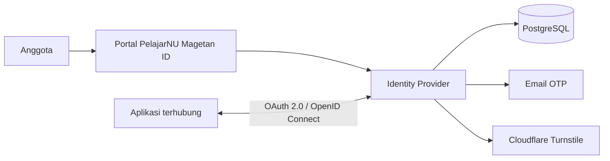

# PelajarNU Magetan ID

**PelajarNU Magetan ID** adalah pusat identitas dan Single Sign-On resmi PC IPNU
IPPNU Kabupaten Magetan. Sistem ini menyediakan satu akun anggota untuk mengakses
berbagai aplikasi yang terhubung dalam ekosistem PelajarNU Magetan.

Portal utama tersedia di [pelajarnumagetan.id](https://pelajarnumagetan.id) dan
dokumentasi integrasi tersedia di
[doc.pelajarnumagetan.id](https://doc.pelajarnumagetan.id).

## Tentang sistem

PelajarNU Magetan ID bertindak sebagai **Identity Provider**. Identitas anggota,
autentikasi, persetujuan akses, dan siklus token dikelola secara terpusat sehingga
aplikasi terhubung tidak perlu membuat sistem akun dan login sendiri-sendiri.

Sistem menggunakan OAuth 2.0 Authorization Code dengan PKCE dan OpenID Connect.
Aplikasi memperoleh identitas pengguna melalui klaim standar berbasis pasangan
stabil `iss` dan `sub`, sedangkan role serta permission bisnis tetap dikelola oleh
masing-masing aplikasi tujuan.

## Kemampuan utama

- Registrasi anggota dengan verifikasi email menggunakan OTP enam digit.
- Perlindungan registrasi menggunakan Cloudflare Turnstile dan validasi
  server-side.
- Login terpusat untuk seluruh aplikasi yang telah terdaftar.
- OAuth 2.0 Authorization Code dengan PKCE S256.
- OpenID Connect dengan discovery metadata, ID token RS256, JWKS, dan UserInfo.
- Persetujuan scope per pengguna dan aplikasi.
- Refresh-token rotation, reuse detection, revocation, dan authorization code
  sekali pakai.
- Manajemen aplikasi, redirect URI, client secret, assignment pengguna, serta
  kebijakan akses aplikasi.
- Dashboard profil, keamanan akun, sesi aplikasi, audit log, dan administrasi
  pengguna.
- Provisioning pengguna berbasis outbox untuk sinkronisasi assignment secara
  asinkron dan idempotent.
- Antrean email persisten dengan payload OTP terenkripsi dan retry exponential.

## Alur autentikasi

1. Pengguna membuka aplikasi yang terhubung.
2. Aplikasi mengarahkan pengguna ke PelajarNU Magetan ID dengan parameter OAuth
   dan PKCE.
3. Identity Provider memverifikasi sesi, kebijakan assignment, scope, dan
   persetujuan pengguna.
4. Aplikasi menerima authorization code sekali pakai dan menukarnya dengan token
   melalui backend.
5. Aplikasi memvalidasi issuer, audience, signature, expiry, nonce, dan klaim
   token sebelum membuat sesi lokal.

## Peran dan akses

| Peran | Tanggung jawab |
| --- | --- |
| `anggota` | Mengelola profil, keamanan, sesi, consent, dan aplikasi miliknya. |
| `super_admin` | Mengelola pengguna, status akun, role internal, serta audit aktivitas platform. |

Aplikasi dapat menggunakan policy `assigned_only` untuk membatasi akses kepada
pengguna yang ditugaskan atau `all_active_users` untuk seluruh anggota aktif.
Penonaktifan akun maupun pencabutan assignment langsung membatalkan grant dan
token yang masih berlaku.

## Arsitektur

| Komponen | Teknologi | Fungsi |
| --- | --- | --- |
| Portal | Next.js, React, TypeScript, Tailwind CSS | Antarmuka akun, consent, dan administrasi. |
| Identity API | Go, Gin, GORM | Autentikasi, OAuth/OIDC, kebijakan akses, dan worker asinkron. |
| Database | PostgreSQL | Identitas, client, grant, token, audit, dan transactional outbox. |
| Dokumentasi | Docusaurus | Referensi protokol dan panduan integrasi aplikasi. |
| Operasional | Nginx dan systemd | Reverse proxy, TLS termination, serta pengelolaan service production. |

## Keamanan

- Kata sandi disimpan dalam bentuk hash bcrypt dan dibatasi panjang inputnya.
- Cookie sesi menggunakan `HttpOnly`, `Secure`, dan kebijakan `SameSite` yang
  sesuai dengan arsitektur subdomain.
- Client secret dan payload OTP sensitif disimpan menggunakan enkripsi AES-GCM.
- Access token dan ID token ditandatangani dengan RSA serta dipublikasikan melalui
  JWKS.
- Redirect URI harus cocok secara persis dan seluruh client wajib memakai PKCE
  S256.
- Turnstile diverifikasi oleh backend dengan pembatasan hostname dan action.
- Audit log mencatat aktivitas autentikasi, administrasi, consent, dan grant.
- Credential production hanya disimpan pada environment server dan tidak menjadi
  bagian repository.

## Layanan resmi

| Layanan | Alamat |
| --- | --- |
| Portal identitas | [pelajarnumagetan.id](https://pelajarnumagetan.id) |
| Identity API | [api.pelajarnumagetan.id](https://api.pelajarnumagetan.id) |
| Dokumentasi | [doc.pelajarnumagetan.id](https://doc.pelajarnumagetan.id) |
| Short URL | [s.pelajarnumagetan.or.id](https://s.pelajarnumagetan.or.id) |

## Status dan versi

PelajarNU Magetan ID telah digunakan sebagai layanan production. Proyek mengikuti
[Semantic Versioning](https://semver.org/lang/id/), dengan riwayat perubahan di
[`CHANGELOG.md`](CHANGELOG.md) dan artefak versi pada halaman
[GitHub Releases](https://github.com/Inur123/sso-fixed-ipnuippnu/releases).

Versi terbaru: **v2.0.0**.

## Organisasi

PelajarNU Magetan ID dikembangkan untuk mendukung layanan digital resmi
**PC IPNU IPPNU Kabupaten Magetan**.
