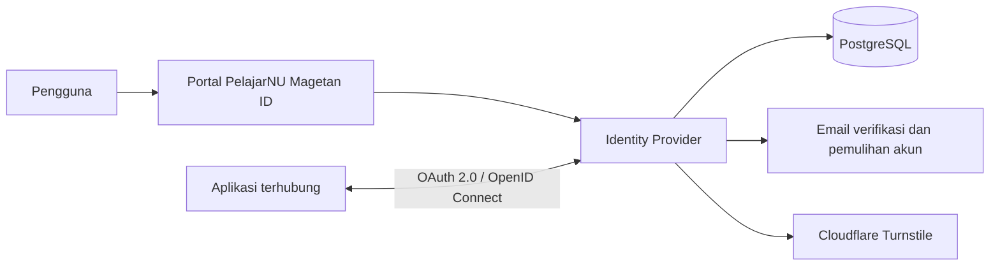

  

  <h1>PelajarNU Magetan ID</h1>

  

    Pusat identitas dan Single Sign-On resmi PC IPNU IPPNU Kabupaten Magetan. 
    Satu akun untuk mengakses berbagai layanan digital yang terhubung.
  

  

    
    
    
  

  

    
    
    
    
    
  

  

    <a href="https://pelajarnumagetan.id">Portal identitas</a>
    ·
    <a href="https://api.pelajarnumagetan.id/.well-known/openid-configuration">OpenID Connect</a>
    ·
    <a href="https://doc.pelajarnumagetan.id">Dokumentasi integrasi</a>
  

## Ringkasan layanan

| Informasi | Nilai |
| --- | --- |
| Fungsi | Identity Provider dan Single Sign-On |
| Protokol | OAuth 2.0 Authorization Code + PKCE S256 dan OpenID Connect |
| Lingkungan | Production |
| Zona waktu | `Asia/Jakarta` (WIB) |
| Versi rilis | `v2.3.0` |
| Portal | [pelajarnumagetan.id](https://pelajarnumagetan.id) |

PelajarNU Magetan ID menyediakan satu akun SSO untuk mengakses berbagai aplikasi
yang terhubung dalam ekosistem PelajarNU Magetan. Dokumentasi integrasi tersedia
di [doc.pelajarnumagetan.id](https://doc.pelajarnumagetan.id).

## Tentang sistem

PelajarNU Magetan ID bertindak sebagai **Identity Provider**. Identitas pengguna,
autentikasi, persetujuan akses, dan siklus token dikelola secara terpusat sehingga
aplikasi terhubung tidak perlu membuat sistem akun dan login sendiri-sendiri.

Sistem menggunakan OAuth 2.0 Authorization Code dengan PKCE dan OpenID Connect.
Aplikasi memperoleh identitas pengguna melalui klaim standar berbasis pasangan
stabil `iss` dan `sub`, sedangkan role serta permission bisnis tetap dikelola oleh
masing-masing aplikasi tujuan.

## Kemampuan utama

- Registrasi akun SSO dengan nama, email, nomor HP, jenis kelamin, dan
  verifikasi email menggunakan OTP enam digit.
- Perlindungan registrasi menggunakan Cloudflare Turnstile dan validasi
  server-side.
- Login terpusat untuk seluruh aplikasi yang telah terdaftar.
- Pemulihan kata sandi melalui tautan sekali pakai dengan masa berlaku 15 menit,
  pembatasan permintaan, dan pencabutan sesi serta token lama setelah reset.
- OAuth 2.0 Authorization Code dengan PKCE S256.
- OpenID Connect dengan discovery metadata, ID token RS256, JWKS, dan UserInfo.
- Persetujuan scope per pengguna dan aplikasi.
- Refresh-token rotation, reuse detection, revocation, dan authorization code
  sekali pakai.
- Manajemen aplikasi, redirect URI, client secret, assignment pengguna, serta
  kebijakan akses aplikasi.
- Dashboard profil, keamanan akun, sesi aplikasi, audit log, dan administrasi
  pengguna.
- Provisioning pengguna berbasis outbox untuk sinkronisasi assignment secara
  asinkron dan idempotent.
- Antrean email OTP, reset kata sandi, dan notifikasi keamanan dengan payload
  sensitif terenkripsi, retry exponential, serta template berlogo SSO.
- Tanggal dan jam aplikasi konsisten menggunakan `Asia/Jakarta` (WIB).
- Backup database khusus super admin, secara manual maupun otomatis setiap
  Minggu pukul 02.00 WIB, dengan retensi 10 backup berhasil dan pemrosesan ulang
  jadwal yang terlewat setelah layanan kembali siap.
- Arsip backup terenkripsi di Cloudflare R2 dan unduhan SQL PostgreSQL setelah
  konfirmasi kata sandi akun SSO. File `.sql` siap diimpor ke PostgreSQL tanpa
  access key R2 atau dekripsi manual, untuk pemulihan terencana oleh pengelola.

## Alur autentikasi

1. Pengguna membuka aplikasi yang terhubung.
2. Aplikasi mengarahkan pengguna ke PelajarNU Magetan ID dengan parameter OAuth
   dan PKCE.
3. Identity Provider memverifikasi sesi, kebijakan assignment, scope, dan
   persetujuan pengguna.
4. Aplikasi menerima authorization code sekali pakai dan menukarnya dengan token
   melalui backend.
5. Aplikasi memvalidasi issuer, audience, signature, expiry, nonce, dan klaim
   token sebelum membuat sesi lokal.

## Peran dan akses

| Peran | Tanggung jawab |
| --- | --- |
| `anggota` | Mengelola profil, keamanan, sesi, consent, dan aplikasi miliknya. |
| `super_admin` | Mengelola pengguna, status akun, role internal, audit aktivitas, serta backup database. |

Aplikasi dapat menggunakan policy `assigned_only` untuk membatasi akses kepada
pengguna yang ditugaskan atau `all_active_users` untuk seluruh pengguna aktif.
Penonaktifan akun maupun pencabutan assignment langsung membatalkan grant dan
token yang masih berlaku.

## Arsitektur

| Komponen | Teknologi | Fungsi |
| --- | --- | --- |
| Portal | Next.js, React, TypeScript, Tailwind CSS | Antarmuka akun, consent, dan administrasi. |
| Identity API | Go, Gin, GORM | Autentikasi, OAuth/OIDC, kebijakan akses, dan worker asinkron. |
| Database | PostgreSQL | Identitas, client, grant, token, audit, dan transactional outbox. |
| Penyimpanan objek | Cloudflare R2 | Aset aplikasi dan arsip backup terenkripsi pada namespace terpisah. |
| Dokumentasi | Docusaurus | Referensi protokol dan panduan integrasi aplikasi. |
| Operasional | Nginx dan systemd | Reverse proxy, TLS termination, serta pengelolaan service production. |

## Keamanan

- Kata sandi disimpan dalam bentuk hash bcrypt dan dibatasi panjang inputnya.
- Cookie sesi menggunakan `HttpOnly`, `Secure`, dan kebijakan `SameSite` yang
  sesuai dengan arsitektur subdomain.
- Client secret serta payload OTP dan reset yang sensitif disimpan menggunakan
  enkripsi AES-GCM. Tabel token reset hanya menyimpan hash token.
- Access token ditandatangani dengan HS256. ID token memakai RS256, dengan
  kunci publik tersedia melalui JWKS.
- Redirect URI harus cocok secara persis dan seluruh client wajib memakai PKCE
  S256.
- Turnstile diverifikasi oleh backend dengan pembatasan hostname dan action.
- Audit log mencatat aktivitas autentikasi, administrasi, consent, dan grant.
- Arsip backup dilindungi enkripsi age dan SSE-C R2. Akses backup dibatasi
  untuk super admin dengan pemeriksaan sesi, Origin, dan konfirmasi kata sandi.
  File SQL yang sudah diunduh tidak terenkripsi dan harus disimpan secara privat.
  Kunci arsip tetap dikelola backend, bukan dimasukkan oleh pengguna saat impor SQL.
- Credential production hanya disimpan pada environment server dan tidak menjadi
  bagian repository.

## Layanan resmi

| Layanan | Alamat |
| --- | --- |
| Portal identitas | [pelajarnumagetan.id](https://pelajarnumagetan.id) |
| Identity API | [api.pelajarnumagetan.id](https://api.pelajarnumagetan.id) |
| Dokumentasi | [doc.pelajarnumagetan.id](https://doc.pelajarnumagetan.id) |

## Status dan versi

PelajarNU Magetan ID telah digunakan sebagai layanan production. Proyek mengikuti
[Semantic Versioning](https://semver.org/lang/id/), dengan riwayat perubahan di
[`CHANGELOG.md`](CHANGELOG.md) dan artefak versi pada halaman
[GitHub Releases](https://github.com/Inur123/sso-fixed-ipnuippnu/releases).

Versi terbaru: **v2.3.0**.

## Organisasi

PelajarNU Magetan ID dikembangkan untuk mendukung layanan digital resmi
**PC IPNU IPPNU Kabupaten Magetan**.
